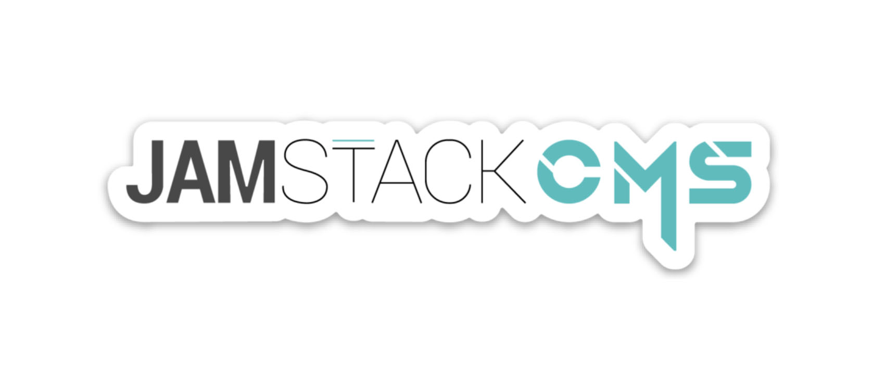
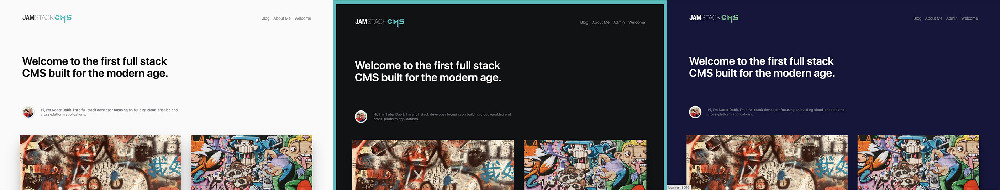

# JAMstack CMS (beta)

End to end serverless blogging & CMS system. Built with GraphQL, [Gatsby](https://www.gatsbyjs.org/) & [AWS Amplify](https://aws-amplify.github.io/). Theming based on the [Novela](https://github.com/narative/gatsby-theme-novela) theme by [Narative](https://twitter.com/narative). 

### Philosophy

JAMstack CMS is built to give you the ability to deploy a full stack serverless website in just a few minutes. JAMstack CMS includes the following features built in:

- Authentication & authorization for admin users
- Database with secure API access
- Server-rendered front end for builds
- Dynamic front-end for admins (enables admins to create, update, and delete content)
- Configurable settings
- Admin dashboard



#### Build time vs run time

With server rendered applications there are typically two types of execution environments, one at build time and one at run time.

The issue with dealing with server rendered applications in the traditional way was that it was not possible to make edits directly in the UI because the build would not accurately represent the current version of the application served at the last build time.

JAMstack CMS solves this issue by giving you two views at run time, including both the static build as well as a dynamic Admin view that allows you to manipulate content and preview pages before building.

This way you have the opportunity to test out new posts and web pages before deploying them to your live environment.

#### 3 Ways to build a page

1. Static page - As with any Gatsby site, can still create a custom static page and route by just creating a new file in the `src/pages` directory. These pages will all be created at build time.

2. Blog post - In the Admin panel you can create Blog posts that will be dynamically generated at build time. These posts will be queried at build time from the server and used to build the pages. Any images referenced from your image gallery will be downloaded and served locally from the public/downloads folder.

3. Dynamic page - Similarly to creating a post, you can use the WYSYWIG editor and drag and dop interface to create web pages complete with rich text editing.

### This is a beta version!

While the CMS is ready to deploy today as it is, this project is still in beta. There is quite a bit of work to do before I am ready to ship version 1. Here are some of the things I will be focusing on:

1. Improved accessibility
2. Performance
3. Comment feature
4. Native Gatsby theming
5. Enabling other cloud providers
6. More page boilerplates
7. Tests
8. TypeScript
9. Massive code cleanup 😅

If you are interested in contributing to this project, please let me know!

## Deploying the CMS

1. Update the [Amplify CLI](https://aws-amplify.github.io/docs/) to the latest version

```sh
$ yarn global add @aws-amplify/cli
```

2. Clone the repository

```sh
$ git clone https://github.com/jamstack-cms/jamstack-cms.git

$ cd jamstack-cms

$ yarn
```

3. Configure admin emails

Open __amplify/backend/function/jamstackcmsc9ee2ce6PostConfirmation/src/add-to-group.js__ and update the admin emails for the users you'd like to add by adding them to the array of emails on line 7.

```javascript
const adminEmails = ["youremail1@domain.com", /* ... other email addresses */]
```

4. Initialize the Amplify project

```sh
$ yarn run jamstack-init
```

During the initialization, you'll be prompted for the following

```
? Do you want to configure Lambda Triggers for Cognito? Y
? Which triggers do you want to enable for Cognito
❯◉ Post Confirmation
? What functionality do you want to use for Post Confirmation
❯◉ Create your own module
? Enter the name of the group to which users will be added. Admin
```

5. Deploy the back end

```sh
$ yarn run jamstack-push
```

6. Run the project

```sh
$ yarn run jamstack-develop
```

7. Sign up and then sign in with an Admin email address by clicking on the __Profile__ link in the footer.

8. Once signed in as an Admin, you will see the Admin link in the navigation. Click on the Admin link to begin creating posts and pages.

10. Once you've created a post, run `npm run jamstack-develop` to create a new build and see the new live post.

### Deploying to Amplify Console or Netlify

To deploy to Amplify Console or Netlify, you'll need to set the environment variable for `APPSYNC_KEY`. This value can be found in `jamstack-api-key.js`.

#### Webhook

Once deployed, you can configure the webhook url by running the following command:

```sh
$ node configureWebhook
```

---

### Context

WordPress has dominated for quite some time with estimates that it powers around 30% of all websites today. One of the reasons for the popularity of WordPress is that it is composed of all of the elements needed for such a platform, including these necessary elements:

- Authentication & authorization
- Database
- API
- Front end

While WordPress started as a blogging tool, it has evolved over the years into a powerful website builder and a robust content management system.

With updated tooling on both the front end and the back end we are starting to see the need for similar tooling in our modern stack.

JAMstack CMS fills in this gap by giving you a customizable end to end solution allowing you to get up and running with a full stack serverless website & blog with just a few commands on your command line.

### Features

- Authentication
- Sharable preview links
- Secure, signed images
- Admin panel
- Comments
- Server-side rendering

### TODOs / Roadmap

- Comments
- Video support
- Dynamic logo from Admin
- Analytics dashboard
- Post categories
- WYSWYG option for blog posts
- Providers for non AWS specific services
- Custom authentication flow
- Offline / caching of posts
- Pagination of posts
- Dynamic dropdown menu of pages
- More articles from <site name>

### Tools

Here are some of the tools used to build JAMstack CMS:
- Gatsby
- Emotion 
- Date FNS 
- Marked 
- AWS Amplify
- Slate